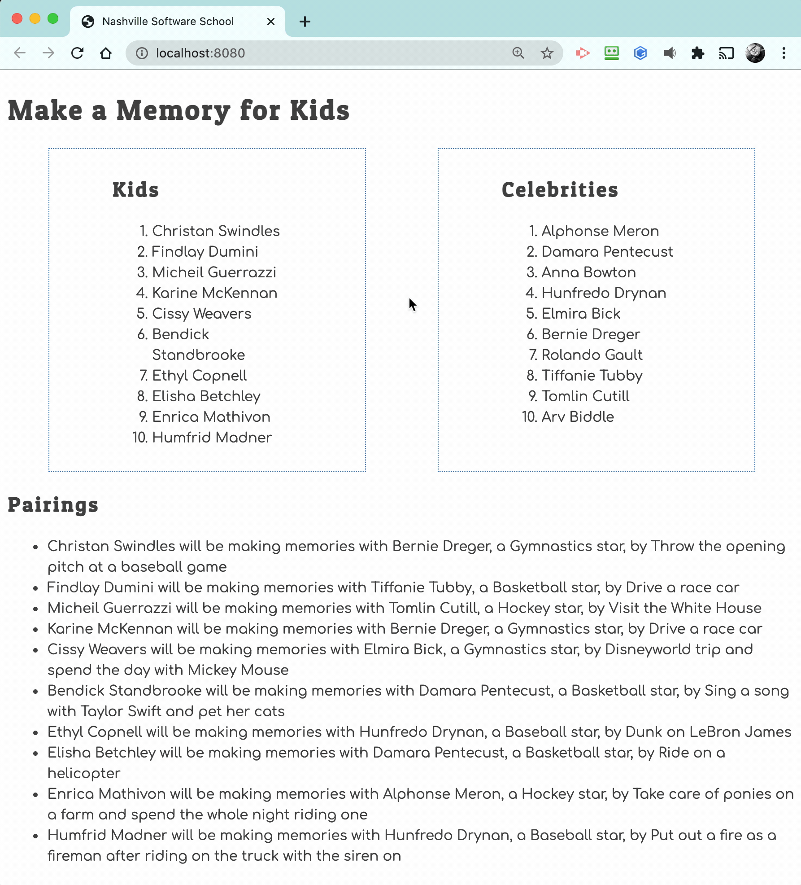

# Events and Debugging Assessment

Time to assess how well you have learned to use the debugging tools in Chrome Dev Tools, and writing click event listeners. This application is to show kids with illnesses and the memories the would like to make. Celebrities sign up to help kids make memories.

> 🧨 Make sure you answer the vocabulary and understanding questions at the end of this document before notifying your coaches that you are done with the project

## Event Listeners to Create

1. When the kid name is clicked, it should display their wish.
1. When the celebrity name is clicked, it should display their sport.
1. The pairings list should should contain the pairing in the following format.
    ```html
    {child name} will be making memories with {celebrity name}, a {celebrity sport} star, by {child wish}
    ```

Below is an animation showing how the application should look when complete and how the event listeners should work.



## Setup

Your instruction team will provide a link for you to create your assessment repository. Once your repo is created, clone it to your machine.

1. Make sure you are in your `workspace` directory.
1. `git clone {github repo SSH string}`.
1. `cd` into the directory it creates.
1. `code .` to open the project code.
1. Use the `serve` command to start the web server.
1. Open the URL provided in Chrome.

Make sure your Developer Tools are open at all times while working on this project. Use the messages provided in the Console to determine what code needs to be fixed or implemented, and use breakpoints in the Sources tab to step through your code as you debug.

## Vocabulary and Understanding

Before you click the "Complete Assessment" button on the Learning Platform, add your answers below each question and make a commit.

1. When a child is clicked on in the browser, which module contains the code that will execute on that event happening? Can you explain the algorithm of that logic?
   > When a child is clicked on the browser, the event listener function from the Kids.js module is called. The event it is listening for is a click within the browser. If the clicked html contains the data attribute type of "child", then it will search through a copied array of child objects from the database.js file. When it finds a child whose id property is equal to the one of the clicked html target, it displays a window alert displaying the child's name and wish.
2. In the **Pairings** module, why must the `findCelebrityMatch()` function be invoked inside the `for..of` loop that iterates the kids array?
   > Because the child object contains the foreign key of the celebrity that they are associated with, which in this case is the celebrity id. The for..of loop will check all child objects in the array until the child.celebrityId matches the celebrity.id.
3. In the **CelebrityList** module, can you describe how the name of the sport that the celebrity plays can be displayed in the window alert text?
   > Using ${celebrity.sport} (which is known as string interpolation) we can embed the celebrity.sport value into the window.alert call, which displays a text box to the browser.
4. Can you describe, in detail, the algorithm that is in the `main` module?
   > The mainContainer variable uses the document method querySelector to get the element that has the id of "container". The variable applicationHTML is set to a string that contains a header, an article to hold the details, a section for the children that calls the imported Kids() function, a section for the celebrities that calls the imported Celebrities() function, and a separate article to call the Pairings() function for the pairings of children and celebrities. The Kids() function imported from Kids.js returns an html formatted string that consists of the properties of child objects from the array of child objects that has been imported from the database module. The Celebrities() function imported from CelebrityList.js returns an html formatted string that consists of the properties of the celebrity object in the data tags, similar to the Kids() function. The Pairings() function returns an html formatted string that goes through the array of child objects and displays the child's name, wish, and the celebrity they are associated with. After all of this data has been stored as an html formatted string in the applicationHTML variable, it is set as the innerHTML for the mainContainer.
